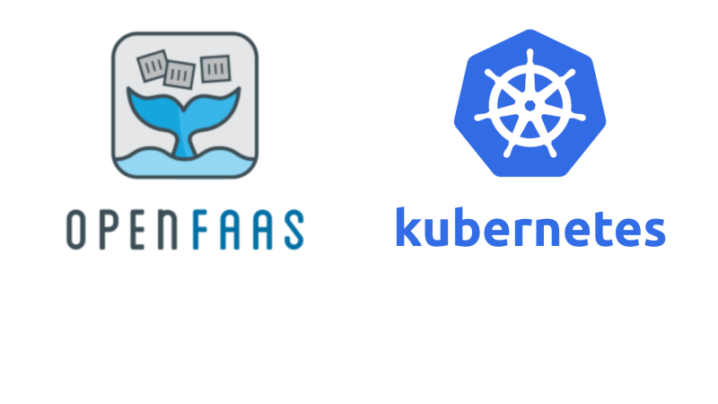

# Third Homework

**Exploring Modern Cloud Paradigms: Kubernetes (K8S), Serverless and Ray**

Due date until <mark>1404-03-20</mark> at [this](https://forms.gle/hCEU4nQ5e7Su4AWm6) google form.

## Objective

This homework assignment aims to provide hands-on experience with key cloud computing concepts: container orchestration with Kubernetes, the serverless paradigm, and distributed computing with Ray, all within a local Kubernetes environment simulated using kind.

**Note**: <mark>Use the given URLs for guidance.</mark>

## Introduction

This assignment is divided into three main parts, building upon each other to demonstrate how different cloud-native technologies can be deployed and managed on a Kubernetes cluster. You will set up a local Kubernetes cluster using kind, deploy a simple application, integrate an open-source serverless platform, and finally deploy and run a distributed application using Ray.<mark>Additionally, Master's and PhD students have an advanced section</mark> focusing on federated learning on serverless platforms.

## Homework Assignment Outline

### 1.Prerequisites

Before starting this assignment, ensure you have the following installed and configured on your local machine:

- Docker: Required by kind to run Kubernetes nodes as containers,
- [kubectl](https://pwittrock.github.io/docs/tasks/tools/install-kubectl/): The Kubernetes command-line tool,
- [kind](https://kind.sigs.k8s.io): Kubernetes in Docker.
- [Lens](https://k8slens.dev): Kubernetes IDE,
- [faas-cli](https://github.com/openfaas/faas-cli) (considering the choice),
- [Helm](https://helm.sh/docs/intro/install/): The package manager for Kubernetes.
- Additional libraries for Federated Learning (for advanced section): (e.g., PyTorch, TensorFlow, Flower, FedML).

#### Deliverables:

Verify installation of all prerequisites and note down the versions of key tools (docker --version, kubectl version, kind version and helm version). Include this information in your submission report.

### 2.Kubernetes Fundamentals with kind

In this part, you will set up a local Kubernetes cluster using kind and perform basic operations.

  
  
Source: github.com/kubernetes

#### Tasks:

2.1.**Create a kind cluster**: Create a basic single-node kind cluster.

2.2.**Deploy a simple application**: Deploy a standard Nginx deployment and service using YAML manifests.

2.3.**Expose the application**: Expose the Nginx service using a NodePort or by configuring ingress. Explain your chosen method.

2.4.**Scale the application**: Scale the Nginx deployment to multiple replicas.

2.5.**Access the application**: Verify you can access the Nginx welcome page.

2.6.**Install Prometheus and Grafana using Helm**:

2.6.1.**Add the required Helm repositories** (e.g., prometheus-community).

2.6.2.**Install the kube-prometheus-stack Helm chart, which includes Prometheus, Grafana**.

2.6.3.**Access the Prometheus and Grafana dashboards**(you may need to use port-forwarding).

2.7.**Access the K8S cluster via lens**: Open the cluster configuration located in `~/.kube/config` in lens.  

#### Deliverables:

- YAML manifest for the kind cluster configuration.
- YAML manifests for the Nginx deployment and service.

- Screenshots or command line output showing:

    - kind create cluster output.

    - kubectl apply -f ... output for deployment and service.

    - kubectl get pods, kubectl get services, kubectl get deployments output.

    - kubectl scale deployment ... output.

    - Output showing successful access to the Nginx page (e.g., curl output or browser screenshot).

    - helm install ... output for the Prometheus/Grafana chart.

    - kubectl get pods -n prometheus (or the namespace where the chart was installed) output.

    - Screenshots of the Prometheus and Grafana dashboards accessed via port-forwarding or other methods.

    - Screenshots of lens and cluster metrics in lens.

- A brief written explanation of each step, the purpose of the YAML files, and how Helm was used to deploy Prometheus and Grafana.

### 3.Serverless Deployment on K8S

  
  
Source: thinkmicroservices.com

You will integrate an open-source serverless platform into your kind cluster and deploy a simple function. We recommend using OpenFaaS for its ease of installation on kind, but you are free to explore other options like Knative if you prefer (ensure compatibility with kind).

#### Tasks:

3.1.**Install the chosen Serverless Platform**: Follow the platform's documentation to install it onto your kind cluster. This typically involves applying several YAML manifests.

3.2.**Develop a simple function**: Create a small function (e.g., in Python) that takes a string as input and returns a modified string (e.g., reversed, uppercase).

3.3.**Deploy the function**: Use the serverless platform's tools (e.g., faas-cli) to build and deploy your function to the kind cluster.

3.4.**Invoke the function**: Call your deployed function using the platform's gateway or CLI.

3.5.**Check lens**: Check cluster status in lens.

#### Deliverables:

- Link to the documentation or the specific commands/manifests used to install the serverless platform.

- Source code of your serverless function.

- Function definition file (e.g., [stack.yml for OpenFaaS](https://docs.openfaas.com/reference/yaml/)).

- Screenshots or command line output showing:

    - Successful installation of the serverless platform components (kubectl get pods -n PLATFORM-NAMESPACE).

    - Successful deployment of your function.

    - Output of invoking your function with sample input and showing the correct output.

    - Screenshots of lens given cluster status.

A brief written explanation of the serverless platform you chose, why you chose it, and how your function works and was deployed.

### 4.Ray on K8S

  
  
Source: Ray Official Website

This part focuses on deploying a Ray cluster on Kubernetes and running a simple distributed Ray application.

#### Tasks:

4.1.**Deploy a Ray cluster**: [Use Ray's Kubernetes operator or official YAML](https://docs.ray.io/en/latest/cluster/kubernetes/index.html#kuberay-index) configurations to deploy a Ray head node and one or more worker nodes on your kind cluster.

4.2.**Run a simple Ray application**: Write a small Python script that uses Ray to perform a simple distributed task (e.g., parallel function execution, using Ray actors). Run this script from your local machine, connecting to the Ray cluster on kind ([use ray example (intermediate or advanced)](https://docs.ray.io/en/latest/ray-core/examples/overview.html)).

4.3.**Access the Ray dashboard**: Expose the Ray cluster dashboard and access it and take a screenshot.

4.4.**Check lens**: Check cluster status in lens.

4.5.**Comparison of Ray and Serverless**: Write a brief comparison of Ray and the serverless platform you used in Part 2. Discuss their core differences in architecture, execution model, state management, and typical use cases. Explain when you might choose one over the other for a specific application or workload.

#### Deliverables:

- You Ray and Serverless comparison report. 

- Link to the documentation or the specific commands/manifests used to deploy the Ray cluster on Kubernetes.

- YAML manifests for the Ray head and worker nodes.

- Source code of your simple Ray application.

- Screenshots or command line output showing:

    - Successful deployment of the Ray cluster components (kubectl get pods).

    - Output of running your Ray application script, demonstrating distributed execution.

    - Screenshot of the Ray dashboard.

    - Screenshot of the Ray dashboard.

    - Screenshots of lens given cluster status.

A brief written explanation of what Ray is, how it was deployed on Kubernetes, and how your simple Ray application works.

### 5.Advanced Tasks (For Master's and PhD Students)

<mark>This section includes 50% of the total grade for master's and PhD students.</mark>

This section is mandatory for Master's and PhD students and optional for others. It delves into the research area of federated learning on serverless platforms.

#### Tasks:

5.1.**Research and Paper Review**: Find and read at least three recent research papers (published within the last 2-3 years) focusing on implementing or optimizing Federated Learning (FL) algorithms on serverless computing platforms. Summarize the key ideas, advantages, and challenges presented in each paper <mark>**specially clients data privacy**</mark>.

5.2.**Approach Selection**: Choose one of the approaches described in the papers that you find most interesting or feasible to implement within the kind and serverless setup from Part 2 and 3. Justify your choice.

5.3.**Implementation and Deployment**: Implement a simplified version of the chosen FL approach using the serverless platform deployed in Part 3. This might involve:

5.3.1.**Creating serverless functions for client-side model training updates**.

5.3.2.**Creating a serverless function or a separate service for the federated averaging/aggregation step**.

5.3.3.**Setting up a mechanism for clients to send updates to the server and receive the global model**.

5.3.4.**Use a simple dataset (e.g., MNIST subset) and a small model for demonstration**.

5.4.**Demonstration and Results**: Run your implemented federated learning system on the kind cluster. Demonstrate its functionality and show results, such as:

- Output showing the training process (e.g., loss reduction over rounds).

- Screenshots of relevant logs from serverless functions or aggregation service.

- Any metrics you can collect regarding the performance or efficiency of the serverless FL implementation.

#### Deliverables:

- List of the three research papers read, including titles, authors, publication venues, and a brief summary of each.

- A written explanation of the chosen approach, including the justification for selecting it.

- Source code for your serverless functions and any other components of your FL implementation.

- Configuration files (e.g., YAML) used to deploy your FL components on the serverless platform.

- Screenshots or command line output demonstrating the execution of your federated learning system and showing the results (e.g., training logs, final model performance on a test set if applicable).

A brief discussion of the challenges encountered during implementation and potential future improvements.

## Submission Requirements

Your submission should be a single compressed archive (e.g., .zip, .tar.gz) containing:

- **A PDF report**: This report should include:

    - For each part:

    - A clear heading for the part.

    - A brief introduction to the part.

    - The required written explanations for each task.

    - The required screenshots and command line output, clearly labeled.

    - A brief conclusion summarizing your experience.

- **A folder containing the code and YAML files**: Organize this folder by part (e.g., part1/, part2/, part3/, etc) and include all the YAML manifests and source code files you created or used.

Good luck with your assignment!