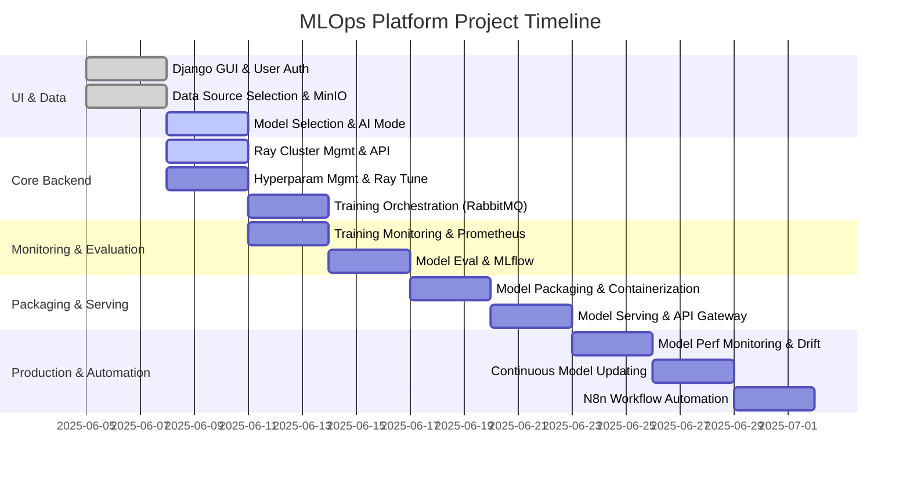

# Project: Automated MLOps Platform with Ray

# Automated MLOps Platform with Ray

## Project Application: What This Platform Delivers

This platform is a **web-based MLOps solution** that allows users to:

- **Upload or select datasets** from MinIO (S3-compatible storage)
- **Choose or upload a machine learning model** (e.g., CNN for MNIST, or user’s own PyTorch/Keras code)
- **Set or auto-tune hyperparameters** (e.g., learning rate, batch size, optimizer)
- **Launch distributed training jobs** on Ray clusters (with GPU/CPU support, managed by Docker)
- **Monitor training progress and system resource usage** in real time (via Prometheus and Grafana)
- **Track all experiments and models** (hyperparameters, metrics, artifacts, and versioning) with MLflow
- **Package and serve trained models** as APIs (using Ray Serve, Docker, and REST endpoints)
- **Monitor model performance and detect data drift** in production (Prometheus, custom drift detection)
- **Trigger automatic retraining and model updates** when performance degrades or drift is detected (N8n workflows)
- **Manage model versions and rollback** to previous states as needed

**All of this is accessible through a simple, secure Django web interface.**
Users do not need to know anything about Ray, Docker, or the underlying infrastructure.

---

## System Architecture Diagram

```mermaid
flowchart TD
    User[User] --> Django[Django GUI & User Auth]
    Django --> MinIO[Data Source Selection & MinIO]
    Django --> ModelSel[Model Selection & AI Mode]
    Django --> RayMgmt[Ray Cluster Mgmt & API]
    Django --> Rabbit[Training Orchestration (RabbitMQ)]
    MinIO --> RayTrain[Hyperparam Mgmt & Ray Tune]
    ModelSel --> RayTrain
    RayMgmt --> RayTrain
    RayTrain --> Rabbit
    Rabbit --> Prom[Training Monitoring & Prometheus]
    Rabbit --> MLflow[Model Eval & MLflow]
    RayTrain --> MLflow
    MLflow --> Docker[Model Packaging & Containerization]
    Docker --> Serve[Model Serving & API Gateway]
    Serve --> Drift[Model Perf Monitoring & Drift]
    Drift --> Update[Continuous Model Updating]
    Update --> MLflow
    Drift --> N8n[N8n Workflow Automation]
    Prom --> Grafana[Grafana Dashboards]
    RayMgmt --> RayDash[Ray Dashboard]
```

---

## Team Assignments and Timeline (Gantt Chart)

**There are 13 teams, each with 2 people. Each team is assigned one major phase.**


| Team | Assigned Phase | Description |
| :-- | :-- | :-- |
| Team 1 | Django GUI \& User Auth | Build the Django web interface, user login/registration, and main navigation. |
| Team 2 | Data Source Selection \& MinIO | Implement data upload/selection in the GUI, integrate MinIO for secure S3 storage. |
| Team 3 | Model Selection \& AI Mode | Create GUI for model template selection and user model upload, map to backend configs. |
| Team 4 | Ray Cluster Mgmt \& API | Develop backend logic to provision Ray clusters (with Docker), manage GPU/CPU allocation, ensure user isolation. |
| Team 5 | Hyperparam Mgmt \& Ray Tune | Build hyperparameter input forms and integrate Ray Tune for automated search/tuning. |
| Team 6 | Training Orchestration (RabbitMQ) | Set up RabbitMQ, implement job submission/queueing, develop backend workers for job execution and status tracking. |
| Team 7 | Training Monitoring \& Prometheus | Instrument training scripts for Prometheus metrics, set up exporters, create Grafana dashboards for training. |
| Team 8 | Model Eval \& MLflow | Integrate MLflow for experiment tracking, log all metrics, parameters, and artifacts, enable model versioning. |
| Team 9 | Model Packaging \& Containerization | Automate Docker packaging of trained models, prepare Ray Serve deployment images. |
| Team 10 | Model Serving \& API Gateway | Deploy model containers via Ray Serve, expose RESTful APIs, secure endpoints, document usage. |
| Team 11 | Model Perf Monitoring \& Drift | Set up Prometheus monitoring for inference, implement drift detection, configure alerting. |
| Team 12 | Continuous Model Updating | Automate retraining with new data, integrate with MLflow for versioning, implement rollback logic. |
| Team 13 | N8n Workflow Automation | Configure N8n for notifications (email, Slack), automate retraining triggers, integrate with external tools. |




---

## Detailed Phase Responsibilities

### Team 1: Django GUI \& User Auth

- Django project setup
- User registration/login/password reset
- Main navigation and project dashboard
- Project and dataset selection pages


### Team 2: Data Source Selection \& MinIO

- GUI for dataset selection/upload
- Integration with MinIO S3 APIs
- Secure credential management and validation


### Team 3: Model Selection \& AI Mode

- GUI for model template selection and custom model upload
- Backend mapping of user choices to Ray job configs


### Team 4: Ray Cluster Mgmt \& API

- Backend logic to launch Ray clusters via Docker/system API
- GPU/CPU resource detection and allocation
- User isolation for Ray clusters


### Team 5: Hyperparam Mgmt \& Ray Tune

- Forms for manual hyperparameter input
- Ray Tune integration for auto-tuning
- Store configurations for reproducibility


### Team 6: Training Orchestration (RabbitMQ)

- Integrate RabbitMQ for job queueing
- Develop worker logic for job execution
- Job status updates and error handling


### Team 7: Training Monitoring \& Prometheus

- Instrument training scripts for Prometheus metrics
- Set up Prometheus exporters
- Create Grafana dashboards


### Team 8: Model Eval \& MLflow

- Integrate MLflow for experiment tracking
- Log model parameters, metrics, artifacts
- Model versioning and lineage tracking


### Team 9: Model Packaging \& Containerization

- Automate Docker packaging for trained models
- Build Ray Serve deployment images


### Team 10: Model Serving \& API Gateway

- Deploy model containers via Ray Serve
- Expose RESTful APIs for inference
- API authentication, rate limiting, and documentation


### Team 11: Model Perf Monitoring \& Drift

- Set up Prometheus monitoring for inference
- Implement data drift detection algorithms
- Configure alerting and notification


### Team 12: Continuous Model Updating

- Automate retraining pipeline with new data
- Integrate MLflow for new model versioning
- Implement rollback and deployment strategies


### Team 13: N8n Workflow Automation

- Set up N8n workflows for notifications (email, Slack, etc.)
- Automate retraining triggers and integration with external tools

---

## Example User Story

**A data scientist logs in, creates a project, selects MNIST from MinIO, chooses a CNN model, clicks “Auto-tune,” submits the job, watches training in Grafana, reviews results in MLflow, deploys the model via API, and monitors drift. When drift is detected, retraining is triggered and a new model version is deployed automatically.**

---

## Summary

- **Application:** A user-friendly, end-to-end MLOps platform for model training, deployment, monitoring, and lifecycle management.
- **User Experience:** All features are accessible through a web GUI, abstracting backend complexity.
- **Team Assignments:** Each team has a clear, non-overlapping responsibility for a critical phase. No phase is ambiguous or unassigned.
- **Timeline:** The project is scheduled to complete in 2.5 weeks, as shown in the Gantt chart.
- **Architecture:** All major components and their interactions are shown in the architecture diagram.

---