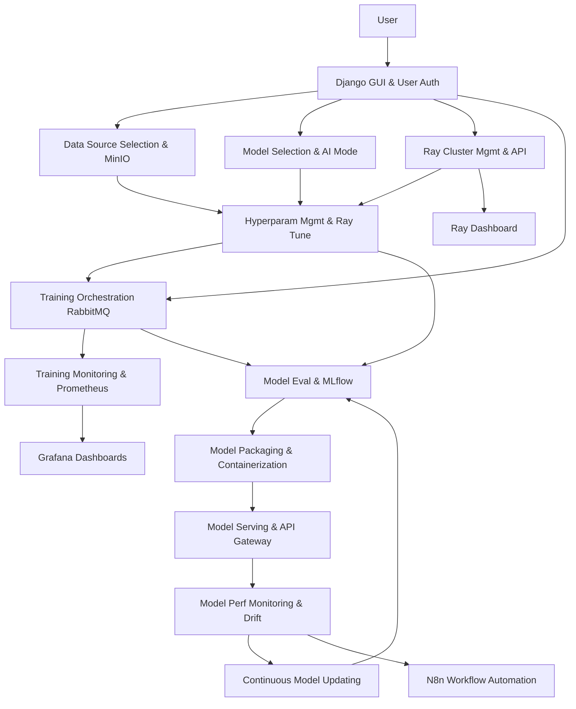
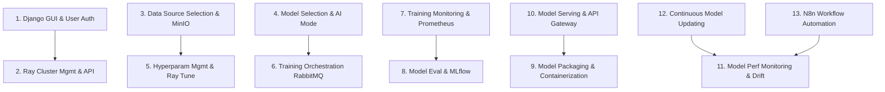
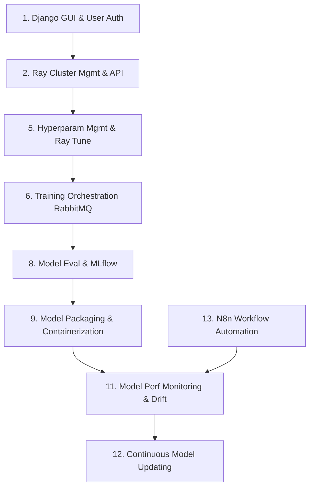

# Project: Automated MLOps Platform with Ray

## 1. Project Overview

# Automated MLOps Platform with Ray

## Overview

This project delivers a web-based MLOps platform that empowers users—including non-experts—to:

- Upload or select datasets from MinIO (S3-compatible storage)
- Choose or define machine learning models (e.g., CNN for MNIST)
- Set or auto-tune hyperparameters
- Launch distributed training jobs on Ray clusters (with GPU/CPU support)
- Monitor training progress and resource usage in real time
- Track experiments and models with MLflow
- Package, version, and serve trained models via APIs
- Monitor models in production for performance and data drift
- Trigger retraining and manage model versions with full history and rollback

All features are accessed through a **Django-powered web GUI**. The backend orchestrates all technical workflows, so users do not need to interact directly with Ray, Docker, or the underlying infrastructure.

---

## System Architecture

The platform consists of the following core components:

| Component | Role |
| :-- | :-- |
| **Django** | Provides the main web GUI and orchestrates workflows. Handles user authentication, project management, and triggers backend processes (e.g., launching training jobs, monitoring, serving models). |
| **Ray** | Executes distributed training, hyperparameter tuning (Ray Tune), and model serving (Ray Serve). Each user/job gets a dedicated Ray cluster, provisioned via Docker with GPU/CPU support as needed. |
| **MinIO** | S3-compatible object storage for datasets, model artifacts, and logs. Users upload/select data here; Ray jobs read/write directly to MinIO. |
| **RabbitMQ** | Decouples job submission from execution. Django submits jobs to RabbitMQ; backend workers listen for jobs and launch Ray clusters. Enables asynchronous, scalable processing. |
| **MLflow** | Tracks experiments, logs hyperparameters, metrics, and artifacts. Provides a searchable model registry with versioning and lineage. |
| **Docker** | Containerizes Ray clusters and model serving APIs, ensuring reproducible, isolated environments with GPU/CPU compatibility. |
| **Prometheus** | Collects metrics (training loss, accuracy, resource usage, inference latency) from Ray clusters and serving APIs. |
| **Grafana** | Visualizes metrics from Prometheus. Provides dashboards for users and admins to monitor training and serving in real time. |
| **Ray Dashboard** | Native Ray UI for monitoring clusters, jobs, and resources. Useful for advanced users and debugging. |
| **N8n** | Workflow automation for notifications (e.g., drift alerts), retraining triggers, and integration with external tools (email, Slack, ticketing). |

### System Architecture Diagram

---

## Workflow: User Journey

1. **User logs in via Django GUI.**
2. **User creates/selects a project and dataset** (from MinIO or uploads new data).
3. **User selects a model architecture** (template or custom).
4. **User sets or auto-tunes hyperparameters** (manual or via Ray Tune).
5. **Job submission and Ray cluster provisioning** (Django → RabbitMQ → Ray cluster via Docker).
6. **Distributed training and real-time monitoring** (metrics to Prometheus, dashboards in Grafana).
7. **Experiment tracking and model registration** (MLflow).
8. **Model packaging and API deployment** (Docker container, Ray Serve).
9. **Model performance monitoring** (Prometheus, Grafana).
10. **Data drift detection and retraining automation** (N8n, MLflow versioning).

---

## Team Assignments

Each of the 13 teams is assigned one heavy (complex) and one light (simpler) phase for balanced workloads and parallel progress.

| Team | Heavy Phase (H) | Light Phase (L) |
| :-- | :-- | :-- |
| Team 1 | 2. Ray Cluster Management \& System API Integration | 1. Django GUI \& User Authentication |
| Team 2 | 5. Hyperparameter Management \& Ray Tune Integration | 3. Data Source Selection \& MinIO Integration |
| Team 3 | 6. Training Orchestration with RabbitMQ | 4. Model Selection \& AI Mode Configuration |
| Team 4 | 8. Model Evaluation \& MLflow Integration | 7. Training Monitoring \& Prometheus Integration |
| Team 5 | 9. Model Packaging \& Containerization | 10. Model Serving \& API Gateway |
| Team 6 | 11. Model Performance Monitoring \& Drift Detection | 12. Continuous Model Updating \& Version Management |
| Team 7 | — | 13. N8n Workflow Automation \& Notification Integration |

---

## Phase Details

> Each phase is described below with its main tasks.

### 1. Django GUI \& User Authentication (L)

- Django project setup
- User registration/login/password reset
- Main navigation and project dashboard
- Project and dataset selection pages

### 2. Ray Cluster Management \& System API Integration (H)

- Backend logic to launch Ray clusters via system API
- Docker orchestration for Ray clusters
- GPU/CPU resource detection and allocation
- User isolation for Ray clusters

### 3. Data Source Selection \& MinIO Integration (L)

- Django forms for data selection/upload
- Integrate MinIO S3 APIs
- Credential management and validation

### 4. Model Selection \& AI Mode Configuration (L)

- GUI for model template selection
- Template management and mapping to Ray jobs
- Allow custom model uploads

### 5. Hyperparameter Management \& Ray Tune Integration (H)

- Forms for manual hyperparameter entry
- Integrate Ray Tune for auto-tuning
- Store configurations for reproducibility

### 6. Training Orchestration with RabbitMQ (H)

- Integrate RabbitMQ for job queueing
- Develop worker logic for job execution
- Job status updates and error handling

### 7. Training Monitoring \& Prometheus Integration (L)

- Instrument training scripts for Prometheus metrics
- Set up Prometheus exporters
- Create Grafana dashboards

### 8. Model Evaluation \& MLflow Integration (H)

- Integrate MLflow for experiment tracking
- Log model parameters, metrics, artifacts
- Model versioning and lineage tracking

### 9. Model Packaging \& Containerization (H)

- Automate model packaging in Docker containers
- Build APIs for model inference (Ray Serve)
- Store container images in registry

### 10. Model Serving \& API Gateway (L)

- Deploy model containers via Ray Serve
- Expose RESTful APIs for inference
- API authentication and rate limiting

### 11. Model Performance Monitoring \& Drift Detection (H)

- Set up inference logging
- Integrate data drift detection algorithms
- Configure alerting and notification

### 12. Continuous Model Updating \& Version Management (L)

- Automate retraining pipeline with new data
- Integrate MLflow for new model versioning
- Implement rollback and deployment strategies

### 13. N8n Workflow Automation \& Notification Integration (L)

- Set up N8n workflows for notifications (email, Slack, etc.)
- Automate retraining triggers and integration with external tools

---

## Project Timeline and Dependencies

Below are diagrams showing phase order, parallelism, and dependencies.
All diagrams use only basic Mermaid `flowchart TD` syntax for maximum compatibility.

### Gantt Chart (Timeline Representation)

### Dependency Diagram (Phase Handoffs)

---

## Example User Story

> A data scientist logs in, creates a project, selects MNIST from MinIO, chooses a CNN model, clicks “Auto-tune,” submits the job, watches training in Grafana, reviews results in MLflow, deploys the model via API, and monitors drift. When drift is detected, retraining is triggered and a new model version is deployed automatically.

---

## Summary

- **Application:** A full-featured, user-friendly, and automated MLOps platform for model training, deployment, monitoring, and lifecycle management.
- **Usage:** Users interact through a web GUI, with all backend complexity abstracted away.
- **Team Assignments:** Balanced, fair, and parallelizable, with clear dependencies and handoff points.
- **Diagrams:** Included for architecture, timeline, and dependencies for maximum clarity.

---